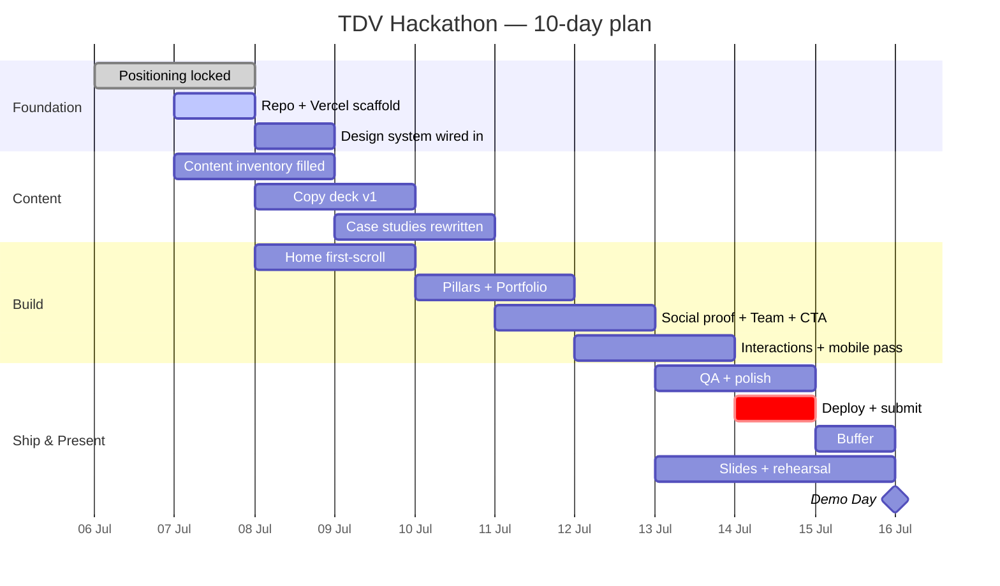

# Timeline & Milestones

**Today: Tue 7 Jul.** 8 build days left before the Wed 15 Jul 23:59 ICT deadline. Treat Jul 14 as the *real* deadline — leave Jul 15 as buffer.

## Gantt (Mermaid — renders in Obsidian)

## Milestone checklist
| # | Milestone | Target | Depends on | Owner |
|---|---|---|---|---|
| M1 | Hero headline locked | Jul 8 | [[Differentiation & Positioning Brief]] | Team |
| M2 | Repo + Vercel live (hello world deployed) | Jul 8 | [[Repo & Environment Setup]] | Dev |
| M3 | First-scroll section done & deployed | Jul 10 | M1, M2, [[Design System Overview]] | Dev |
| M4 | Content inventory complete | Jul 9 | [[Content Inventory]] | Non-dev |
| M5 | All 8 mandatory requirements met | Jul 13 | [[Mandatory Requirements Tracker]] | Team |
| M6 | Full mobile + interaction pass | Jul 13 | M3–M5 | Dev |
| M7 | Deployed & submitted | **Jul 14** | M6 | Dev |
| M8 | Slides + rehearsal done | Jul 15 | [[Demo Day Plan]] | Team |
| M9 | Demo Day | Jul 16 10:00 | M7, M8 | Team |

## Cadence
- **Daily 15-min standup** → log in [[09-Logs/Daily/README|Daily Logs]] (template: [[_templates/Daily Log Template]]).
- **Mid-point review Jul 11** — are all 8 mandatory items on track? Cut scope if not.

## Risk register
| Risk | Likelihood | Impact | Mitigation | Tag |
|---|---|---|---|---|
| Claude log written last-minute | High | High (25%) | Update [[Claude Utilization Log]] daily | #risk |
| Portfolio undercuts strategy claim | Med | High | Rewrite case studies Strategy→Delivery | #risk |
| Scope creep past mandatory 8 | High | Med | Freeze scope Jul 11; extras = stretch | #risk |
| Imagery bottleneck | Med | Med | Lock [[Content Inventory#Asset & image plan]] early | #risk |
| Demo under-rehearsed | Med | Med (15%) | Slides skeleton Jul 12, rehearse Jul 15 | #risk |
| Single-dev bottleneck | Med | High | Use [[MCP, Skills & Subagents\|subagents]] to parallelize | #risk |

## Related
[[Project Charter]] · [[Competition Brief]] · [[Mandatory Requirements Tracker]]
