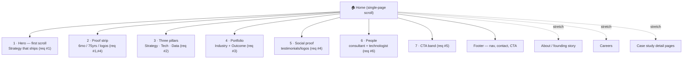

# Sitemap & Information Architecture

*Structure that guarantees all 8 [[Mandatory Requirements Tracker|mandatory requirements]] land. A single strong landing page can satisfy every requirement; extra pages are stretch.*

## Recommended structure (single-page-first)

## Section-by-section map
| # | Section | Mandatory req | Content source | Design system parts |
|---|---|---|---|---|
| 1 | Hero (first scroll) | #1, #8 | [[Messaging & Copy Deck#Locked / candidate hero]] | GradientMesh + Orb + Button |
| 2 | Proof strip | #1, #4 | [[Messaging & Copy Deck#Reusable proof stats]] | Metric (tabular) |
| 3 | Three pillars | #2 | [[Messaging & Copy Deck#The 3 pillars]] | Card, Tag |
| 4 | Portfolio | #3 | [[Content Inventory#Case study bank]] | Card (mockup), Tag |
| 5 | Social proof | #4 | [[Content Inventory#Social proof]] | Card (warm), logo strip |
| 6 | People | #6 | [[Content Inventory#Team & people]] | Card |
| 7 | CTA band | #5 | [[Messaging & Copy Deck#CTAs]] | dark band + Button |
| 8 | Footer | #5 | [[Content Inventory#Company facts]] | Footer (ui_kit) |

## IA principles
- **First scroll carries the argument.** A visitor who only sees the hero + proof strip must already understand: Terra does *both* strategy and delivery, and here's proof. Everything below is elaboration.
- **One idea per section**, alternating white → cool → warm-tawny → dark bands (design-system rhythm) for visual pacing.
- **One filled Cerulean CTA per band** — discipline drives the UI score.

## Related
[[Page-Specs/Home (Landing) Spec]] · [[UX Principles & Notes]] · [[Design System Overview]] · [[Mandatory Requirements Tracker]]
