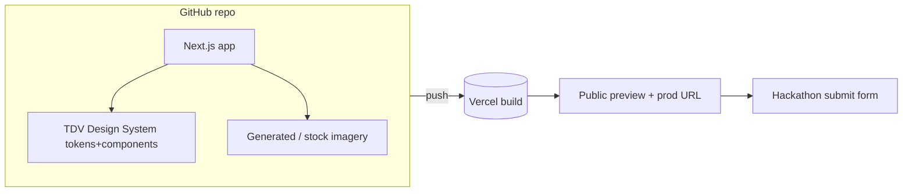

# Tech Stack & Architecture

*Optimized for our team's strength (front-end-heavy — see [[Team & Roles#Capability notes]]) and a 10-day clock. No back-end in scope → zero infra risk.*

## Recommended stack (opinionated)
| Layer | Choice | Why |
|---|---|---|
| Framework | **Next.js (App Router)** | SSG/static export, great Vercel DX, First's daily driver |
| Language | **TypeScript** | Team strength; safer refactors under time pressure |
| Styling | Design-system **tokens (`styles.css`)** + Tailwind if needed | Consume the DS; don't reinvent |
| Components | **TDV design-system JSX** ([[Design System Overview]]) | The head start — Button/Card/Metric/Orb/GradientMesh |
| Icons | **Lucide** (flagged substitution) | Matches Poppins geometry |
| Hosting | **Vercel** | Required-style deploy target; instant preview URLs |
| VCS/CI | **GitHub** + Vercel auto-deploy | Push → preview → prod |

> [!note] Alternative if Next feels heavy
> A single static `index.html` consuming the design system's `ui_kits/marketing-site/` is a legitimate faster path. Decide at [[Repo & Environment Setup|repo setup]] and tag `#decision`. Trade-off: Next gives routing/SEO/image optimization; static gives speed-to-first-deploy.

## Consuming the design system
1. Link the token entry point: `03-Design-System/Terra Digital Ventures Design System/styles.css`.
2. Keep fonts via `tokens/fonts.css` (Poppins + Sarabun from Google Fonts — no substitution needed).
3. Import components from `components/` (namespace `window.TerraDigitalVenturesDesignSystem_f41591`) or adapt the JSX into the app.
4. Reuse `ui_kits/marketing-site/` (Nav, HomeScreen, Footer) as scaffolding, then reshape to [[Sitemap & Information Architecture]].
5. Enforce the two hard rules (one Cerulean filled CTA/band; tabular numerics) — an oxlint adherence config ships in the DS (`_adherence.oxlintrc.json`).

## Architecture (simple by design)

## Non-goals
No database, no auth, no server API (SQL is a known gap and irrelevant here). Contact form = mailto or a no-back-end form service if time allows.

## Related
[[Repo & Environment Setup]] · [[Deployment & Submission]] · [[Design System Overview]]
